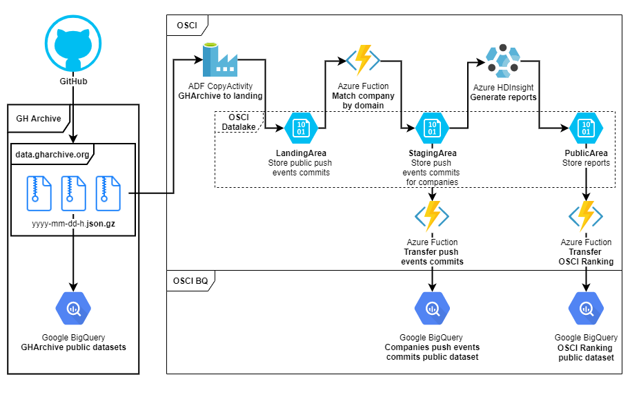

# Open Source Contributor Index (OSCI)
OSCI, an open source project, aiming to track and measure open source activity on GitHub by commercial organizations. It allows organizations, communities, analysts and individuals involved in Open Source to get insights about contribution trends among commercial organizations by providing access to up-to-date data through an intuitive interface.

[](https://github.com/epam/osci-working-group)

### Table of contents
- [How does OSCI work?](#how-does-osci-work)
- [How are commit authors linked to commercial organizations?](#how-are-commit-authors-linked-to-commercial-organizations)
- [How can I submit my company for ranking?](#how-can-i-submit-my-company-for-ranking)
- [How can I contribute to OSCI?](#how-can-i-contribute-to-osci)
- [Quick Start](#quickstart)
  * [Installation](#installation)
  * [Configuration](#configuration)
  * [Sample run](#sample-run)
- [OSCI Versioning](#osci-versioning) 
- [License](#license)
- [Contact Us](#contacting-us)

## How does OSCI work?

To create this index, the system processes GitHub push events data from [GH Archive](https://www.gharchive.org/):



OSCI tracks two measures at each organization:
  -  **Active contributors**, the number of people who authored 10 or more commits over a period of time
  -  **Total community**, the number of people who made at least one commit over a period of time

## How are commit authors linked to commercial organizations?

The system uses email domain of the commit author to identify the organization. Your organization is missing in the ranking? Feel free to add your organization to the list. 

*Note: OSCI does not rank open source activity contributed by universities, research institutions and individual entrepreneurs.*

## How can I submit my company for ranking?

1) Check whether the organization you propose to add matches OSCI definition:
   - not an educational, governmental, non-profit or research institution;
   - registered, commercial organization;
   - sells goods or services for the purpose of making a profit.

1) Create a new pull request.

1) Go to company domain match list ([company_domain_match_list.yaml](osci/preprocess/match_company/company_domain_match_list.yaml))

1) Double check that the organization you want to add is not listed.

1) Add the **email domain** of the company and the company name to the table. For example:
    ```yaml
    - company: Facebook
      domains:
        - fb.com
      regex:
    ```     
1) If the company has more than 1 email domain for its employees, add all of them to block `domains` (or `regex` for using regular expression). For example:
    ```yaml
    - company: Facebook
      domains:
        - fb.com
        - facebook.com
      regex:
        - ^.*\.fb\.com$
        - ^.*\.facebook\.com$
    ```
1) Select the industry to which your company belongs from the following list:
   - Automotive;
   - Banking, Insurance & Financial Services;
   - Education;
   - Energy & Utilities;
   - Entertainment;
   - Healthcare and Pharma;
   - Professional Services;
   - Public Sector;
   - Retail & Hospitality;
   - Technology;
   - Media & Telecoms;
   - Travel & Transport;
   - Other (please specify);

   For example:
   ```yaml
   - company: Facebook
     domains:
       - fb.com
       - facebook.com
     regex:
       - ^.*\.fb\.com$
       - ^.*\.facebook\.com$
     industry: Media & Telecoms
   ```

Our team will review your pull request and merge it if everything is correct.

*Note: since OSCI processes the data for the previous month, you'll see your organization's rank in the beginning of the next month.*

## How can I contribute to OSCI?
See [CONTRIBUTING.md](CONTRIBUTING.md) for details on contribution process.

## QuickStart
OSCI is deployed into Azure Cloud environment using Azure DataFactory, Azure Function and Azure DataBricks. However, the code available on GitHub does not require using of Azure Cloud. 
Run the application from the command line using the instruction below.

### Installation
1) Clone repository
    ```shell script
         git clone https://github.com/epam/OSCI.git
    ```
1) Go to project directory
    ```shell script
         cd OSCI
    ```
1) Install requirements
    ```shell script
         pip install -r requirements.txt
   ```

### Configuration
Create a file `local.yml` (by default this file added to .gitignore) in the directory [`osci/config/files`](osci/config/files). 
A sample file [`default.yml`](osci/config/files/default.yml) is included, please don't change values in this file

### Sample run
1) Run script to download data from archive (for example for 01 January 2020)
    ```shell script
         python3 osci-cli.py get-github-daily-push-events -d 2020-01-01
    ```
1) Run script to add company field (matched by domain) (for example for 01 January 2020)
    ```shell script
         python3 osci-cli.py process-github-daily-push-events -d 2020-01-01
    ```
1) Run script to add company field (matched by domain) (for example for 01 January 2020)
    ```shell script
         python3 osci-cli.py daily-osci-rankings -td 2020-01-02
    ```

## OSCI Versioning
For a comprehensive OSCI versioning we adopted the following approach `<year>.<month>.<number of patch >`) e.g. 2021.05.0. We expect regularly monthly updates including releases associated with submission of a new company for ranking.

## License
OSCI is licensed under the [GNU General Public License v3.0](LICENSE).

## Contact Us
For support or help using OSCI, please contact us at [OSCI@epam.com](mailto:OSCI@epam.com).
